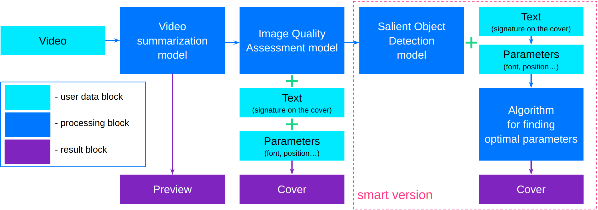

<p align=center>

</p>
The repository of the graduation project ***"AI assistant for video creators"*** in [MADE](https://data.vk.company/) [2022] [Presentation](https://docs.google.com/presentation/d/1VbRrEFBQCc05oWiRMZyq6dliLDUc99o-sGDUk5kJhlw/edit?usp=sharing). 

## 1. Introduction
Over the past decade, there has been a phenomenal surge in activity in the video content market. On YouTube alone, users upload [>500 hours of videos per minute](https://www.tubefilter.com/2019/05/07/number-hours-video-uploaded-to-youtube-per-minute/). In this regard, the issue of increasing the ClickThrough Rate (CTR) of each video becomes a significant problem both for the creators of the video and for the platforms that host it.  
In this project, we solve several tasks:
1. Automatic preview creation;
2. Automatic creation of the video cover.  

Which would contribute to an increase in CTR.
## 2. General architecture
The following is the general architecture of the project:
<p align=center>

</p>

The project includes three parts:
1. Creating a video preview;
2. Selection of frames for the cover;
3. Adding text to the cover.

## 3. Project Description
### 3.1 Creating a video preview

### 3.2 Selection of frames for the cover

### 3.3 Adding text to the cover

## 4. CLI

## 5. API and bot


```bash
cd app
python inference.py casum --source input/12345/apple.mp4 --save-path ../output/12345/apple.mp4 --final-frame-length 27 --device cuda
python cover_gen.py smart --source ../_videos/1.png --save-path ../output/1_text.png --text "TRAVEL BLOG" --position "left-top" --font-path fonts/CenturySB-Bold.ttf --font-size 60 --font-color white --stroke-color black --stroke-width 5
```